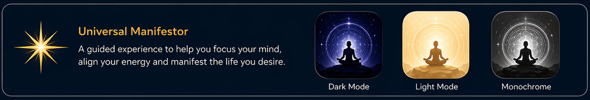

# Universal Manifestor

### Focus Your Energy. Align Your Intention. Manifest Your Reality.

**Universal Manifestor** is a cutting-edge meditation and intention-setting application that combines immersive 3D visualizations with spatial audio technology to help you achieve deep meditative states and manifest your desires.

Available on **iOS**, **iPadOS**, and **macOS**.

  

---

## 🌟 Features

### Four Meditation Modes

| Mode | Purpose | Duration |
|------|---------|----------|
| 🎯 **Focus** | Sharpen concentration, enhance clarity | 5-15 min |
| ⚖️ **Align** | Balance energy, harmonize mind-body-spirit | 10-20 min |
| ✨ **Manifest** | Set intentions, visualize goals | 15-30 min |
| 🌌 **Universe** | Deep connection, expanded consciousness | 20-45 min |

### Core Experience

- **🌀 Immersive 3D Visualization**: Real-time particle field rendering with dynamic orbital mechanics
- **🎵 Spatial Audio**: Binaural beats, isochronic tones, and 3D ambient soundscapes
- **🎯 Intention Setting**: Private, secure intention tracking (all data stays on your device)
- **📊 Session Management**: Customizable durations, automatic logging, gentle reminders

---

## 📱 Platform Support

| Platform | Minimum Version |
|----------|----------------|
| iPhone | iOS 16.0+ |
| iPad | iPadOS 16.0+ |
| Mac | macOS 13.0+ (Ventura) |

**Universal Binary**: Optimized for both Apple Silicon (M1/M2/M3) and Intel Macs.

---

## 🔒 Privacy First

Universal Manifestor is built with privacy as a core principle:

- ✅ **No Data Collection** - We don't collect any personal information
- ✅ **No Analytics** - No tracking of your usage patterns
- ✅ **No Third-Party SDKs** - No external monitoring
- ✅ **Local Storage Only** - All data stays on your device
- ✅ **No Cloud Sync** - Your meditation history is private
- ✅ **No Account Required** - Use anonymously

[Read our complete Privacy Policy](docs/privacy.html)

---

## 🚀 Getting Started

### Installation

1. Download from the [App Store](https://apps.apple.com) (search "Universal Manifestor")
2. Open the app and grant microphone permission (for audio playback)
3. Choose your meditation mode
4. Set your intention
5. Begin your session

### Quick Start Guide

1. **Find a quiet space** - Minimize distractions
2. **Use headphones** - For the full binaural audio experience
3. **Choose your mode** - Start with Focus if you're new
4. **Set your intention** - What do you want to achieve?
5. **Relax and observe** - Let the visualization and audio guide you

For detailed instructions, see the [Complete App Guide](docs/APP_GUIDE.md).

---

## 🎨 Technology

Universal Manifestor uses advanced visualization and audio processing:

- **Real-time 3D particle physics simulation**
- **Binaural beat generation for brainwave entrainment**
- **Spatial audio processing**
- **Native Swift/SwiftUI implementation**
- **Metal-accelerated rendering**

---

## 📚 Documentation

- **[App Guide](docs/APP_GUIDE.md)** - Complete user manual
- **[Privacy Policy](docs/privacy.html)** - Our commitment to your privacy
- **[Terms of Service](docs/terms.html)** - Usage terms and conditions
- **[Support](docs/support.html)** - Help and troubleshooting
- **[Wiki](https://github.com/noktirnal42/universal_manifestor/wiki)** - Detailed technical documentation and analysis

---

## 🛠️ For Developers

This repository contains the public-facing documentation and web presence for Universal Manifestor.

### What's Here

- ✅ Public documentation
- ✅ Marketing assets
- ✅ Privacy policy and legal documents
- ✅ GitHub Pages website

### What's Not Here

- ❌ Source code (proprietary)
- ❌ Xcode project files
- ❌ Build scripts
- ❌ Private keys or certificates

### Web Presence

The `docs/` folder contains the GitHub Pages site. To enable:

1. Go to **Settings** → **Pages**
2. Set source to `main` branch, `/docs` folder
3. Your site will be live at `https://noktirnal42.github.io/universal_manifestor`

---

## 📞 Support

### Get Help

- **Email**: support@universalmanifestor.app
- **Website**: [universalmanifestor.app](https://universalmanifestor.app)
- **Documentation**: [App Guide](docs/APP_GUIDE.md)

### Report Issues

- **Email**: support@universalmanifestor.app
- **GitHub Issues**: [Create an issue](https://github.com/noktirnal42/universal_manifestor/issues)

---

## 📱 Download

| Platform | Download |
|----------|----------|
| iOS/iPadOS | [App Store](https://apps.apple.com/app/universal-manifestor) |
| macOS | [Mac App Store](https://apps.apple.com/app/universal-manifestor) |

---

## ⭐ Reviews

> "A transformative meditation experience. The visualization is mesmerizing!"  
> **— App Store Review**

> "Finally, a meditation app that respects my privacy. No tracking, no BS."  
> **— Mac App Store Review**

> "The binaural beats combined with the particle field is pure magic."  
> **— Product Hunt**

---

## 📜 Legal

- [Privacy Policy](docs/privacy.html)
- [Terms of Service](docs/terms.html)
- [Support Policy](docs/support.html)

**Copyright © 2026 Universal Manifestor. All rights reserved.**

Universal Manifestor is a trademark of Universal Manifestor.

All other trademarks are the property of their respective owners.

---

## 🌍 Community

- **Website**: [universalmanifestor.app](https://universalmanifestor.app)
- **GitHub**: [github.com/noktirnal42/universal_manifestor](https://github.com/noktirnal42/universal_manifestor)
- **Twitter**: [@UniversalManifestor](https://twitter.com/)
- **Instagram**: [@universalmanifestor](https://instagram.com/)

**Share your experience**: #UniversalManifestor

---

*Last Updated: April 23, 2026*  
*Version: 1.0.0*
