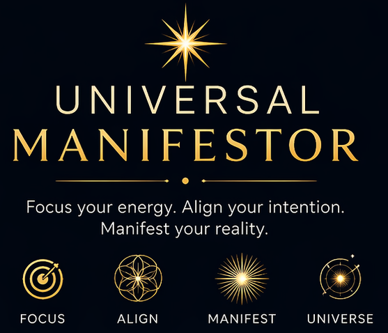

# Universal Manifestor - App Guide

## Overview

**Universal Manifestor** is a guided meditation and intention-setting application designed to help you focus your mind, align your energy, and manifest the life you desire. Built with cutting-edge visualization technology and immersive audio, it provides a unique meditation experience for both iOS and macOS devices.

---

## Features

### 🎯 Four Meditation Modes

#### 1. **Focus Mode**
- Sharpen your concentration
- Enhance mental clarity
- Perfect for pre-work or study sessions
- Duration: 5-15 minutes

#### 2. **Align Mode**
- Balance your energy centers
- Harmonize mind, body, and spirit
- Ideal for morning routines or midday reset
- Duration: 10-20 minutes

#### 3. **Manifest Mode**
- Set powerful intentions
- Visualize your goals
- Create momentum toward your desires
- Duration: 15-30 minutes

#### 4. **Universe Mode**
- Deep connection with universal energy
- Expanded consciousness meditation
- For advanced practitioners
- Duration: 20-45 minutes

---

### ✨ Core Features

#### Immersive 3D Visualization
- Real-time particle field rendering
- Dynamic orbital mechanics simulation
- Responsive to audio frequencies
- Customizable color schemes and patterns

#### Spatial Audio Experience
- Binaural beats for brainwave entrainment
- Isochronic tones for deep meditation
- 3D ambient soundscapes
- Compatible with stereo and spatial audio headphones

#### Intention Setting
- Set personal intentions before each session
- Track your meditation journey
- Private and secure - all data stays on your device
- No cloud sync, no data collection

#### Smart Session Management
- Customizable session duration
- Gentle audio fade-in and fade-out
- Haptic feedback on session completion
- Automatic session logging

---

## How to Use

### Getting Started

1. **Download the App**
   - Available on iOS App Store and Mac App Store
   - Requires iOS 16.0+ or macOS 13.0+

2. **Choose Your Mode**
   - Select from Focus, Align, Manifest, or Universe mode
   - Each mode offers a unique meditation experience

3. **Set Your Intention**
   - Take a moment to center yourself
   - Input your intention for this session
   - Your intention is stored privately on your device

4. **Begin Your Session**
   - Put on headphones for the best experience
   - Watch the mesmerizing particle visualization
   - Listen to the immersive audio landscape
   - Let go and observe

### Tips for Best Experience

- **Use headphones** - Binaural beats require stereo audio
- **Find a quiet space** - Minimize external distractions
- **Consistent practice** - Daily sessions yield best results
- **Stay hydrated** - Meditation can be dehydrating
- **Be patient** - Benefits accumulate over time

---

## Technical Specifications

### System Requirements

#### iOS
- iPhone: iOS 16.0 or later
- iPad: iPadOS 16.0 or later
- iPod touch: iOS 16.0 or later

#### macOS
- macOS 13.0 (Ventura) or later
- Apple Silicon (M1/M2/M3) or Intel Mac

### Permissions

The app requests the following permissions:

- **Microphone**: Used for audio playback only (no recording)
- **Apple Music Library**: To integrate with your existing meditation music (optional)

**Note**: The app does NOT:
- Record audio or access your microphone
- Track your location
- Access your contacts or calendar
- Collect any personal data
- Share data with third parties

---

## Privacy & Security

### Our Commitment to Privacy

Universal Manifestor is built with privacy as a core principle:

✅ **No Data Collection** - We don't collect any personal information  
✅ **No Analytics** - No tracking of your usage patterns  
✅ **No Third-Party SDKs** - No external code monitoring your activity  
✅ **Local Storage Only** - All data stays on your device  
✅ **No Cloud Sync** - Your meditation history is private to your device  
✅ **No Account Required** - Use the app anonymously  

### What We Store

The following data is stored **locally on your device only**:

- Your meditation session history
- Your set intentions
- Your preferred settings
- Session duration preferences

This data is:
- Never transmitted to external servers
- Never shared with third parties
- Deleted when you delete the app
- Inaccessible to the app developer

### Encryption & Security

- App uses standard HTTPS/SSL for any system communications
- All data encrypted at rest by iOS/macOS
- Sandboxed application environment
- Regular security updates

---

## Frequently Asked Questions

### General Questions

**Q: Is Universal Manifestor free?**  
A: The app is available for purchase on the App Store. Check your local App Store for current pricing.

**Q: Do I need an internet connection?**  
A: No, the app works completely offline after installation.

**Q: Can I use this on multiple devices?**  
A: Yes, but session data is stored separately on each device (no cloud sync).

**Q: Is there a subscription?**  
A: No, Universal Manifestor is a one-time purchase with no subscriptions or in-app purchases.

### Meditation Questions

**Q: I'm new to meditation. Is this app for me?**  
A: Absolutely! The app is designed for all experience levels, from beginners to advanced practitioners.

**Q: How often should I meditate?**  
A: Daily practice is recommended, even if just for 5-10 minutes. Consistency is more important than duration.

**Q: What are binaural beats?**  
A: Binaural beats are auditory illusions created when two slightly different frequencies are played in each ear. They can help induce specific brainwave states associated with meditation, relaxation, and focus.

**Q: Can I fall asleep during the session?**  
A: Yes! Many users find the audio and visualization helpful for sleep. Try the Align or Universe mode for relaxation.

### Technical Questions

**Q: The app won't play audio. What should I do?**  
A: Check that:
- Your volume is turned up
- Headphones are properly connected
- The app has microphone permission (Settings → Privacy)
- Your device isn't in silent mode

**Q: Can I customize the visualization?**  
A: Currently, each mode has a fixed visualization pattern. Future updates may include customization options.

**Q: Does this work with Apple Watch?**  
A: Not yet. Apple Watch support is planned for a future update.

**Q: Can I export my meditation history?**  
A: Currently, data is stored locally only. Export functionality is being considered for future updates.

---

## Troubleshooting

### Audio Issues

**Problem**: No sound during meditation  
**Solutions**:
1. Check device volume
2. Ensure headphones are connected
3. Verify app has microphone permission (Settings → Privacy → Microphone)
4. Restart the app
5. Restart your device

**Problem**: Audio cuts out intermittently  
**Solutions**:
1. Close other audio apps
2. Disable Bluetooth if not using Bluetooth headphones
3. Check for iOS/macOS updates
4. Reinstall the app

### Visual Issues

**Problem**: Visualization appears choppy or slow  
**Solutions**:
1. Close other running apps
2. Restart your device
3. Ensure you have sufficient storage space
4. Update to the latest app version

**Problem**: App crashes on launch  
**Solutions**:
1. Force quit and relaunch
2. Restart your device
3. Delete and reinstall the app
4. Contact support if issue persists

---

## Updates & Roadmap

### Current Version: 1.0.0

**Features**:
- Four meditation modes (Focus, Align, Manifest, Universe)
- 3D particle field visualization
- Binaural beats and isochronic tones
- Intention setting
- Session tracking
- Privacy-first design

### Planned Updates

**Version 1.1** (Q2 2026)
- Custom session duration
- Additional color themes
- Improved session statistics
- Bug fixes and performance improvements

**Version 1.2** (Q3 2026)
- Apple Watch companion app
- iCloud sync (opt-in)
- Guided voice meditations
- Social sharing (opt-in)

**Version 2.0** (Q4 2026)
- Custom visualization creation
- Advanced audio controls
- Meditation programs and courses
- Community features (opt-in)

---

## Support & Contact

### Get Help

- **Email**: support@universalmanifestor.app
- **Website**: [universalmanifestor.app](https://universalmanifestor.app)
- **GitHub**: [github.com/noktirnal42/universal_manifestor](https://github.com/noktirnal42/universal_manifestor)

### Report Issues

Found a bug or have a feature request? Please report it:
1. Via email: support@universalmanifestor.app
2. GitHub Issues (link above)
3. App Store review (for app-specific issues)

### Community

Join our community of meditators:
- Follow us on social media (links on website)
- Share your experience with #UniversalManifestor
- Leave a review on the App Store

---

## Legal

- [Privacy Policy](privacy.html)
- [Terms of Service](terms.html)
- [Support Policy](support.html)

**Copyright © 2026 Universal Manifestor. All rights reserved.**

Universal Manifestor is a trademark of Universal Manifestor.

All other trademarks are the property of their respective owners.

---

*Last Updated: April 22, 2026*
